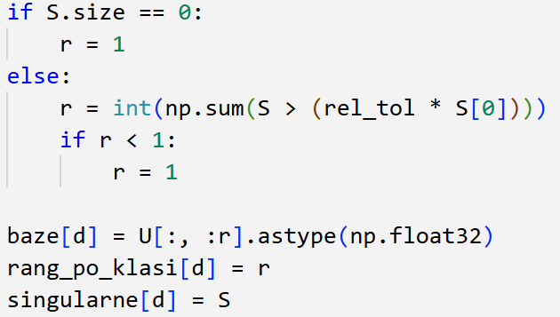

# Prepoznavanje znamenki korištenjem SVD dekompozicije

---

## UVOD
Prepoznavanje rukom pisanih znamenki jedno je od klasičnih problemskih područja strojnog učenja.  
Za ovaj projekt korišten je **MNIST dataset**, koji sadrži 70 000 slika znamenki (0–9), svaka dimenzija 28×28 piksela.  

Cilj projekta je iskoristiti **Singular Value Decomposition (SVD)** za izgradnju klasifikatora znamenki.  
Ideja je da svaka klasa znamenke (0–9) može biti dobro opisana pomoću vlastitog **potprostora** generiranog SVD-om, a nova slika se klasificira prema tome kojem je potprostoru najbliža.

---

## BIBLIOTEKE
- **NumPy** – za rad s matricama i algebarske operacije  
- **Matplotlib** – za vizualizaciju slika i rezultata  
- **TensorFlow/Keras** – za učitavanje MNIST dataseta  

---

## UČITAVANJE PODATAKA
Podaci su preuzeti iz MNIST dataseta:
 

Dataset je podijeljen na:  
- **trening skup**: 60 000 slika  
- **test skup**: 10 000 slika  
Slike originalno imaju vrijednosti piksela 0-255, ali su normalizirane dijeljenjem s 255, tako da pikseli imaju vrijednosti između 0 i 1 radi jednostavnijeg računanja. 
Svaka je slika dimenzije 28x28.

Primjer znamenke za svaku klasu: 

---

## PRIPREMA PODATAKA
Za treniranje klasifikatora odabire se **fiksan broj slika po klasi** (npr. 100 ili više slika za svaku znamenku).  
Svaka slika dimenzija 28×28 pretvara se u vektor dimenzije 784, tako da se slike mogu slagati u matricu oblika:

A_d ∈ R^(784 × n)
gdje je `d` oznaka klase (znamenke), a `n` broj odabranih slika za tu klasu.
---
#DODATI SLLIKU MATRICE koju napraviš

## SVD DEKOMPOZICIJA
Za svaku klasu znamenke `d` računa se SVD dekompozicija:
 
- `U_d` sadrži ortogonalne bazne vektore (potprostor klase)  
- `S_d` je dijagonalna matrica singularnih vrijednosti  
- `V_d^T` matrica s desne strane 

 

Zadržavanjem samo prvih `r` singularnih vrijednosti dobiva se  **aproksimaciju slike** i redukciju dimenzionalnosti.  

**Adaptivni prag** – uzimaju se svi singularni vektori čije vrijednosti prelaze zadani relativni prag.
**U ovom radu zadani relativni prag se odredio treniranjem podataka i uzimanjem najbolje evaluacije, a to je 0.03.**
**Koriste se samo komponente čija je „snaga” barem 3% od najjače komponente S[0].**  
 
---

## KLASIFIKATOR
Nova slika `x` klasificira se na temelju **projekcije slike na potprostore svih klasa**. 
 
Za svaku klasu `d` računa se kut između slike `x` i njezine projekcije na bazu `U_d`. Klasa kojoj pripada najmanji kut proglašava se kao predikcija.
 

---

## EVALUACIJA
Klasifikator je testiran na cijelom **MNIST test skupu (10 000 slika)**.  
Mjeren je postotak točno prepoznatih znamenki.  

- Točnost ovisi o izboru broja slika za kreiranje baze potprostora `k` i ranga `r` te baze. Za premale ili prevelike baze i rangove klasifikator gubi na preciznosti.

**U ovom radu treniranjem podataka i uzimanje najbolje evaluacije najbolji k iznosi 120.**

---

## REZULTATI

---

## AUTOR
Lara Slišković - [GitHub profil](https://github.com/lsliskov), Violeta Tomašević – [GitHub profil](https://github.com/tvojprofil)